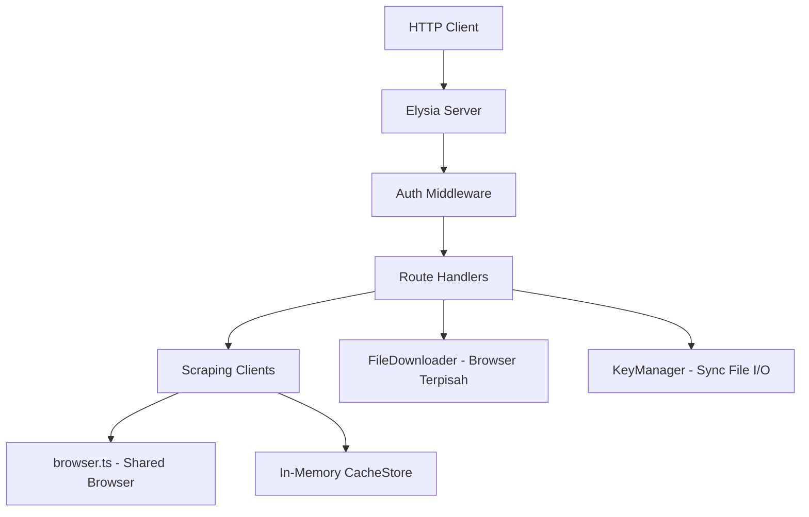
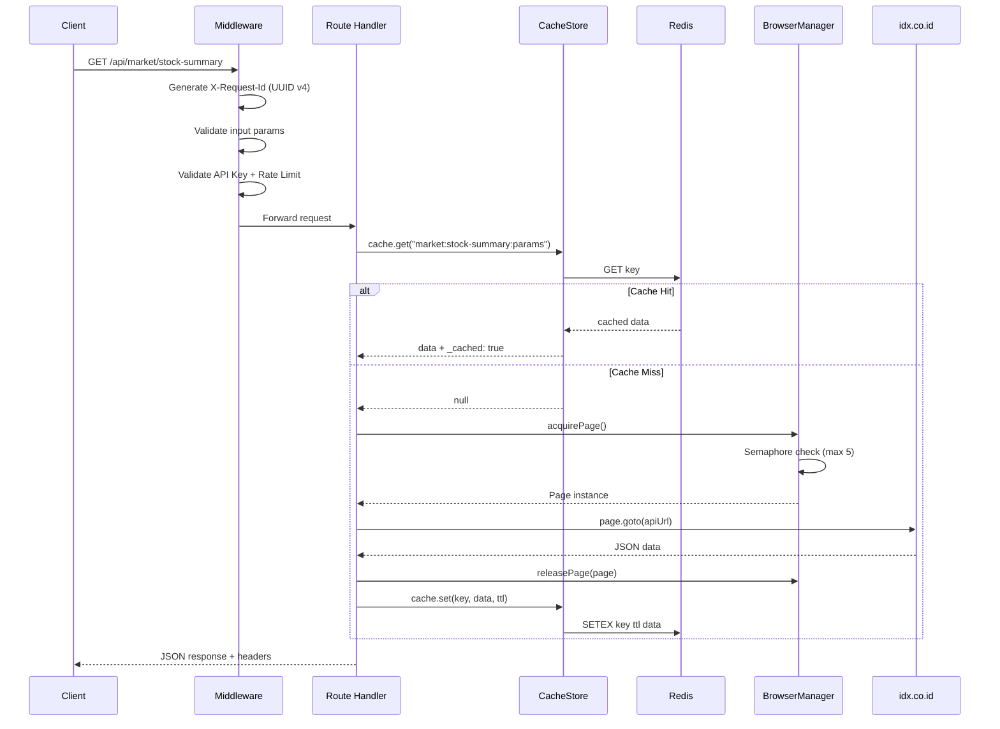
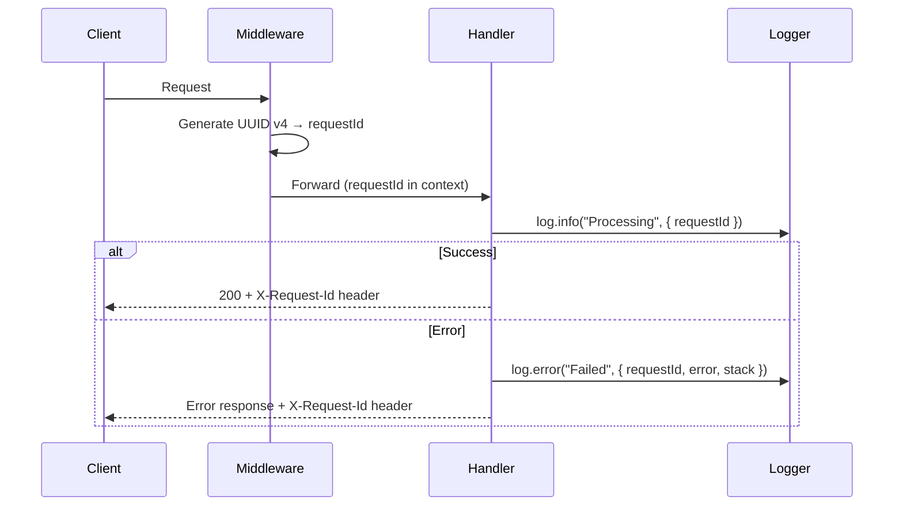

# Dokumen Desain Teknis — IDX Scraper Production-Ready

## Ikhtisar

Dokumen ini menjelaskan desain teknis untuk menyempurnakan IDX Scraper dari prototipe menjadi produk siap jual (production-ready). IDX Scraper adalah REST API berbasis Bun + Elysia yang melakukan scraping data Bursa Efek Indonesia (IDX) melalui Playwright browser automation dengan bypass Cloudflare.

Penyempurnaan mencakup 12 area utama yang saling terkait:

1. **Keamanan Admin** — Constant-time comparison, brute-force protection, validasi kunci minimum 32 karakter
2. **Validasi Input** — Middleware validasi menggunakan Elysia `t` schema untuk semua endpoint
3. **Error Handling** — Format error konsisten dengan X-Request-Id di setiap respons
4. **Endpoint Verification** — Semua 50+ endpoint aktif dan terverifikasi melalui test
5. **Testing** — Unit test + property-based test + integration test menggunakan `bun:test` dan `fast-check`
6. **Caching Redis** — Migrasi dari in-memory `Map` ke Redis dengan fallback otomatis
7. **Monitoring** — Health endpoint diperkaya, structured logging, slow request warning
8. **Docker** — Multi-stage build, docker-compose dengan Redis, graceful shutdown
9. **Dokumentasi API** — Swagger/OpenAPI yang lengkap dengan contoh respons
10. **Refactoring** — Shared browser, CORS module, async file ops, eliminasi duplikasi
11. **Rate Limiting** — Perbaikan header, daily reset WIB, tier enforcement
12. **Keamanan API Key** — Format key, masking, file permissions, expiry, Bearer support

### Keputusan Desain Utama

| Keputusan | Pilihan | Alasan |
|-----------|---------|--------|
| Redis client | `ioredis` | Mature, auto-reconnect, Bun-compatible, cluster support |
| PBT library | `fast-check` | Terbaik untuk TypeScript, integrasi mudah dengan `bun:test` |
| Validasi input | Elysia `t` (TypeBox) | Sudah built-in, zero overhead, auto-generate OpenAPI schema |
| Connection pool | Semaphore pattern | Ringan, tidak perlu library eksternal, cocok untuk max 5 pages |
| Constant-time compare | `crypto.timingSafeEqual` | Built-in Node/Bun, standar industri |
| Docker build | Multi-stage (3 stages) | Pisahkan deps install, Playwright install, dan runtime |

## Arsitektur

### Arsitektur Saat Ini



### Arsitektur Target

```mermaid
graph TB
    Client[HTTP Client] --> CORS[CORS Module]
    CORS --> ReqId[X-Request-Id Middleware]
    ReqId --> Validator[Input Validator]
    Validator --> Auth[Auth + Rate Limit]
    Auth --> Routes[Route Handlers]
    Routes --> CachedScrape[cachedScrape Utility]
    CachedScrape --> Cache[CacheStore - Redis + Fallback]
    Cache --> Redis[(Redis)]
    CachedScrape --> Clients[Scraping Clients]
    Clients --> BrowserMgr[BrowserManager - Pool max 5]
    Routes --> FileDown[FileDownloader - Shared Browser]
    FileDown --> BrowserMgr
    Routes --> KeyMgr[KeyManager - Async File I/O]
    
    Health[/api/health] --> BrowserMgr
    Health --> Cache
    Health --> Redis

    subgraph Middleware Pipeline
        CORS
        ReqId
        Validator
        Auth
    end

    subgraph Infrastructure
        Redis
        BrowserMgr
    end
```

### Alur Request



## Komponen dan Antarmuka

### 1. CacheStore (Redis + Fallback)

**File:** `src/utils/cache.ts`

Menggantikan implementasi `Map` saat ini dengan Redis sebagai backend utama dan fallback ke in-memory jika Redis tidak tersedia.

```typescript
interface ICacheStore {
  get<T>(key: string): Promise<T | null>;
  set(key: string, data: unknown, ttlMs?: number): Promise<void>;
  del(key: string): Promise<void>;
  has(key: string): Promise<boolean>;
  clear(): Promise<void>;
  size(): Promise<number>;
  destroy(): Promise<void>;
  isRedisConnected(): boolean;
}
```

**Perilaku:**
- Koneksi Redis dibaca dari `REDIS_URL` atau `REDIS_HOST`/`REDIS_PORT` (default `localhost:6379`)
- Jika Redis gagal connect, fallback ke `Map` in-memory dan log warning
- Reconnect attempt setiap 30 detik saat Redis down
- Semua method menjadi `async` (breaking change dari implementasi saat ini)
- TTL preset tetap sama: market 30s, news 5m, slow 15m
- Data diserialisasi sebagai JSON string di Redis

### 2. BrowserManager (Connection Pool)

**File:** `src/utils/browser.ts`

Menggantikan fungsi `getBrowser()`/`createPage()` saat ini dengan class yang mengelola pool page dengan semaphore.

```typescript
interface IBrowserManager {
  acquirePage(): Promise<Page>;
  releasePage(page: Page): Promise<void>;
  getActivePagesCount(): number;
  isConnected(): boolean;
  destroy(): Promise<void>;
}
```

**Perilaku:**
- Maksimum 5 page concurrent (dikonfigurasi via `MAX_BROWSER_PAGES` env var)
- `acquirePage()` menunggu jika pool penuh (antrian FIFO)
- `releasePage()` menutup page dan memberi sinyal ke antrian
- Shared browser instance — `FileDownloader` menggunakan `BrowserManager` yang sama
- Auto-reconnect jika browser crash
- Timeout 30 detik untuk antrian (throw error jika terlalu lama menunggu)

### 3. AdminGuard (Keamanan Admin)

**File:** `src/middleware/admin-guard.ts`

Menggantikan fungsi `checkAdmin()` sederhana di `routes/admin.ts`.

```typescript
interface IAdminGuard {
  validate(request: Request): AdminValidationResult;
  isBlocked(ip: string): boolean;
  recordFailure(ip: string): void;
}

interface AdminValidationResult {
  valid: boolean;
  error?: string;
  statusCode?: number;
}
```

**Perilaku:**
- Startup check: tolak start jika `ADMIN_API_KEY` tidak diset atau < 32 karakter
- Constant-time comparison menggunakan `crypto.timingSafeEqual`
- Brute-force protection: blokir IP setelah 10 kegagalan dalam 5 menit, durasi blokir 15 menit
- Respons generik "Invalid admin key" tanpa membedakan jenis kegagalan

### 4. Input Validator

**Pendekatan:** Menggunakan Elysia `t` (TypeBox) schema di setiap route definition.

Tidak perlu middleware terpisah — Elysia sudah mendukung validasi deklaratif di `query`, `body`, `params`. Yang perlu dilakukan:

- Tambahkan `query: t.Object({...})` di setiap endpoint yang menerima query params
- Definisikan shared schemas untuk pattern yang berulang (pagination, date range, stock code)

```typescript
// src/validators/shared-schemas.ts
const PaginationQuery = t.Object({
  pageSize: t.Optional(t.Number({ minimum: 1, maximum: 100, default: 20 })),
  indexFrom: t.Optional(t.Number({ minimum: 0, default: 0 })),
  page: t.Optional(t.Number({ minimum: 1, default: 1 })),
});

const DateRangeQuery = t.Object({
  dateFrom: t.Optional(t.String({ pattern: '^\\d{4}-\\d{2}-\\d{2}$' })),
  dateTo: t.Optional(t.String({ pattern: '^\\d{4}-\\d{2}-\\d{2}$' })),
});

const StockCodeParam = t.Object({
  stockCode: t.String({ pattern: '^[A-Z]{3,6}$' }),
});
```

### 5. Error Handler (Konsisten)

**File:** `src/middleware/error-handler.ts`

Memperkaya global error handler yang sudah ada di `src/index.ts`.

```typescript
interface ErrorResponse {
  success: false;
  error: string;
  statusCode: number;
  fetchedAt: string;  // ISO 8601
}
```

**Perilaku:**
- Setiap request mendapat `X-Request-Id` (UUID v4) di header respons
- Error dari Cloudflare timeout → HTTP 503 + `Retry-After` header
- Error parsing HTML → log detail, return pesan generik
- Unhandled exception → log stack trace, return HTTP 500 generik
- Browser launch failure → HTTP 503, auto-retry pada request berikutnya

### 6. CORS Module

**File:** `src/middleware/cors.ts`

Mengekstrak konfigurasi CORS dari `src/index.ts` ke modul terpisah.

```typescript
interface CorsConfig {
  allowedOrigins: string[];  // dari env ALLOWED_ORIGINS (comma-separated)
  allowedMethods: string[];
  allowedHeaders: string[];
  maxAge: number;
}
```

### 7. KeyManager (Async + Security)

**File:** `src/services/key-manager.ts`

Refactor dari sync file I/O ke async, plus penambahan fitur keamanan.

**Perubahan:**
- `readFileSync` → `Bun.file().text()` (async)
- `writeFileSync` → `Bun.write()` (async) dengan file permission `0600`
- Semua public functions menjadi `async`
- Tambah validasi `expiresAt` di `validateKey()`
- Support `Authorization: Bearer <key>` selain `X-API-Key`
- Respons generik "API key tidak valid" untuk key tidak ditemukan DAN key nonaktif (tidak membedakan)
- Constant-time comparison untuk key lookup menggunakan iterasi semua keys

### 8. cachedScrape Utility

**File:** `src/utils/cached-scrape.ts`

Fungsi utilitas untuk menghilangkan duplikasi pola try-catch-cache di route handlers.

```typescript
async function cachedScrape<T>(options: {
  cache: ICacheStore;
  cacheKey: string;
  ttlMs: number;
  scraper: () => Promise<T>;
  requestId: string;
}): Promise<{ data: T; cached: boolean }>;
```

**Perilaku:**
- Cek cache → jika hit, return dengan `_cached: true`
- Jika miss, jalankan scraper function
- Simpan hasil ke cache
- Tangkap error scraping, log dengan requestId, throw error yang sesuai


## Model Data

### CacheStore Internal State

```typescript
// Redis key format: "idx:{tier}:{endpoint}:{params_hash}"
// Contoh: "idx:market:stock-summary:abc123"

interface RedisCacheConfig {
  url?: string;          // REDIS_URL (prioritas)
  host: string;          // REDIS_HOST (default: localhost)
  port: number;          // REDIS_PORT (default: 6379)
  keyPrefix: string;     // "idx:" 
  reconnectIntervalMs: number; // 30000
}

// Fallback state
interface FallbackState {
  active: boolean;
  fallbackSince: Date | null;
  reconnectTimer: ReturnType<typeof setInterval> | null;
}
```

### BrowserManager Internal State

```typescript
interface BrowserPoolState {
  browser: Browser | null;
  context: BrowserContext | null;
  activePages: number;        // current count
  maxPages: number;           // default 5
  waitQueue: Array<{          // FIFO queue
    resolve: (page: Page) => void;
    reject: (error: Error) => void;
    timeoutId: ReturnType<typeof setTimeout>;
  }>;
}
```

### AdminGuard Brute-Force State

```typescript
interface BruteForceEntry {
  failures: number;
  firstFailureAt: number;  // timestamp ms
  blockedUntil: number;    // timestamp ms, 0 = not blocked
}

// In-memory Map<string, BruteForceEntry> keyed by IP
// Cleanup interval: setiap 5 menit, hapus entry yang sudah expired
```

### API Key (Updated)

```typescript
interface ApiKey {
  id: string;
  key: string;                // format: idsk_live_{64 hex chars}
  name: string;
  tier: TierName;
  email?: string;
  rateLimit: number;          // -1 = unlimited
  dailyLimit: number;         // -1 = unlimited
  active: boolean;
  createdAt: string;          // ISO 8601
  expiresAt?: string;         // ISO 8601, optional
  lastUsed?: string;          // ISO 8601
}
```

### Error Response Format

```typescript
interface ErrorResponse {
  success: false;
  error: string;
  statusCode: number;
  fetchedAt: string;          // ISO 8601
}

// Headers yang selalu disertakan:
// X-Request-Id: string (UUID v4)
// X-RateLimit-Limit: string
// X-RateLimit-Remaining: string  
// X-RateLimit-Reset: string (unix timestamp)
```

### Success Response Format

```typescript
interface SuccessResponse<T> {
  success: true;
  data: T;
  _cached?: boolean;          // true jika dari cache
  fetchedAt: string;          // ISO 8601
}

// Headers:
// X-Request-Id: string (UUID v4)
// Cache-Control: max-age={ttl_seconds}
```

### Health Endpoint Response (Updated)

```typescript
interface HealthResponse {
  success: true;
  status: 'ok' | 'degraded';
  uptime: number;             // detik
  browser: {
    status: 'connected' | 'disconnected';
    activePages: number;
  };
  redis: {
    status: 'connected' | 'disconnected' | 'fallback';
  };
  cache: {
    market: number;
    news: number;
    slow: number;
  };
  memory: {
    rss: number;
    heapUsed: number;
    heapTotal: number;
  };
  timestamp: string;
}
```

### Docker Compose Schema

```yaml
# docker-compose.yml
version: '3.8'
services:
  api:
    build: .
    ports:
      - "${PORT:-3100}:3100"
    environment:
      - ADMIN_API_KEY=${ADMIN_API_KEY}
      - REDIS_URL=redis://redis:6379
      - PORT=3100
      - NODE_ENV=production
      - ALLOWED_ORIGINS=${ALLOWED_ORIGINS:-}
      - LOG_LEVEL=${LOG_LEVEL:-info}
      - MAX_BROWSER_PAGES=${MAX_BROWSER_PAGES:-5}
    volumes:
      - api-data:/app/data
    depends_on:
      redis:
        condition: service_healthy
    restart: unless-stopped

  redis:
    image: redis:7-alpine
    ports:
      - "6379:6379"
    volumes:
      - redis-data:/data
    healthcheck:
      test: ["CMD", "redis-cli", "ping"]
      interval: 10s
      timeout: 5s
      retries: 3
    restart: unless-stopped

volumes:
  api-data:
  redis-data:
```

### Dockerfile Multi-Stage

```dockerfile
# Stage 1: Dependencies
FROM oven/bun:1 AS deps
WORKDIR /app
COPY package.json bun.lock ./
RUN bun install --frozen-lockfile

# Stage 2: Playwright
FROM oven/bun:1 AS playwright
WORKDIR /app
COPY --from=deps /app/node_modules ./node_modules
COPY package.json ./
RUN apt-get update && apt-get install -y --no-install-recommends \
    libnss3 libatk-bridge2.0-0 libdrm2 libxcomposite1 libxdamage1 \
    libxrandr2 libgbm1 libpango-1.0-0 libcairo2 libasound2 \
    libxshmfence1 libx11-xcb1 libxfixes3 libxkbcommon0 \
    fonts-liberation \
    && rm -rf /var/lib/apt/lists/*
RUN bunx playwright install chromium

# Stage 3: Runtime
FROM oven/bun:1 AS runtime
WORKDIR /app

RUN apt-get update && apt-get install -y --no-install-recommends \
    libnss3 libatk-bridge2.0-0 libdrm2 libxcomposite1 libxdamage1 \
    libxrandr2 libgbm1 libpango-1.0-0 libcairo2 libasound2 \
    libxshmfence1 libx11-xcb1 libxfixes3 libxkbcommon0 \
    fonts-liberation curl \
    && rm -rf /var/lib/apt/lists/*

COPY --from=deps /app/node_modules ./node_modules
COPY --from=playwright /root/.cache/ms-playwright /root/.cache/ms-playwright
COPY package.json tsconfig.json ./
COPY src/ src/

RUN mkdir -p /app/data/disclosures /app/data/api-keys

ENV PORT=3100
ENV NODE_ENV=production

EXPOSE 3100

HEALTHCHECK --interval=30s --timeout=10s --start-period=30s --retries=3 \
  CMD curl -f http://localhost:3100/api/health || exit 1

CMD ["bun", "--bun", "run", "src/index.ts"]
```


## Correctness Properties

*Sebuah property adalah karakteristik atau perilaku yang harus berlaku di semua eksekusi valid dari sebuah sistem — pada dasarnya, pernyataan formal tentang apa yang harus dilakukan sistem. Property berfungsi sebagai jembatan antara spesifikasi yang dapat dibaca manusia dan jaminan kebenaran yang dapat diverifikasi mesin.*

### Property 1: Validasi panjang minimum ADMIN_API_KEY

*For any* string yang diberikan sebagai ADMIN_API_KEY, AdminGuard harus menerima string tersebut jika dan hanya jika panjangnya >= 32 karakter.

**Validates: Requirements 1.2**

### Property 2: Admin key salah selalu menghasilkan respons generik yang identik

*For any* string yang bukan merupakan ADMIN_API_KEY yang benar, AdminGuard harus mengembalikan HTTP 401 dengan pesan error yang sama persis ("Invalid admin key"), tanpa variasi berdasarkan input.

**Validates: Requirements 1.3, 1.4**

### Property 3: Constant-time comparison menghasilkan hasil yang benar

*For any* dua string A dan B, fungsi constant-time comparison harus mengembalikan `true` jika dan hanya jika A === B, dengan perilaku yang identik dengan perbandingan biasa dari segi kebenaran.

**Validates: Requirements 1.4**

### Property 4: Validasi parameter numerik

*For any* nilai integer, validator harus menerima nilai tersebut jika dan hanya jika nilainya adalah bilangan bulat positif (>= 1) dan tidak melebihi batas maksimum yang dikonfigurasi per endpoint. Nilai non-integer, negatif, nol, atau melebihi batas harus menghasilkan HTTP 400.

**Validates: Requirements 2.1, 2.2, 2.6**

### Property 5: Validasi kode saham

*For any* string, validator kode saham harus menerima string tersebut jika dan hanya jika cocok dengan pola `^[A-Z]{3,6}$`.

**Validates: Requirements 2.3**

### Property 6: Validasi body pembuatan API key

*For any* objek JSON yang dikirim sebagai body POST untuk pembuatan API key, validator harus menolak dengan HTTP 400 jika field `name` atau `tier` tidak ada, dan menyertakan daftar field yang hilang dalam pesan error.

**Validates: Requirements 2.4**

### Property 7: Validasi format tanggal ISO 8601

*For any* string, validator tanggal harus menerima string tersebut jika dan hanya jika cocok dengan format YYYY-MM-DD dan merupakan tanggal yang valid.

**Validates: Requirements 2.5**

### Property 8: Format respons error konsisten

*For any* respons error dari API server, body JSON harus mengandung field `success` (boolean false), `error` (string), `statusCode` (number), dan `fetchedAt` (string ISO 8601).

**Validates: Requirements 3.1, 3.4**

### Property 9: X-Request-Id unik di setiap respons

*For any* request ke API server, respons harus mengandung header `X-Request-Id` dengan nilai UUID v4 yang valid, dan tidak ada dua request yang menghasilkan X-Request-Id yang sama.

**Validates: Requirements 3.5**

### Property 10: Data kosong dari IDX tetap menghasilkan HTTP 200

*For any* endpoint scraping, ketika sumber data IDX mengembalikan data kosong, API server harus tetap mengembalikan HTTP 200 dengan array data kosong dan `success: true`.

**Validates: Requirements 4.9**

### Property 11: Round-trip format utilities

*For any* bilangan bulat positif `n`, `formatBytes(n)` harus menghasilkan string yang dapat di-parse kembali ke nilai numerik yang ekuivalen. *For any* string `s`, `cleanText(cleanText(s))` harus sama dengan `cleanText(s)` (idempotent).

**Validates: Requirements 5.8**

### Property 12: Cache round-trip dengan TTL

*For any* data yang disimpan di CacheStore dengan TTL tertentu, mengambil data tersebut sebelum TTL berakhir harus mengembalikan data yang identik. Mengambil data setelah TTL berakhir harus mengembalikan null.

**Validates: Requirements 6.1, 6.3**

### Property 13: Browser pool tidak melebihi batas maksimum

*For any* jumlah permintaan concurrent N, BrowserManager tidak boleh memiliki lebih dari `maxPages` (default 5) page yang aktif secara bersamaan. Permintaan yang melebihi batas harus menunggu di antrian.

**Validates: Requirements 6.5, 6.8**

### Property 14: Page cleanup setelah release

*For any* page yang di-acquire dari BrowserManager, setelah releasePage() dipanggil, jumlah active pages harus berkurang tepat 1 dan page tersebut harus dalam keadaan tertutup.

**Validates: Requirements 6.6**

### Property 15: Cache-Control header sesuai TTL

*For any* respons dari endpoint yang di-cache, header `Cache-Control` harus mengandung `max-age` dengan nilai yang sesuai dengan TTL cache endpoint tersebut (30 untuk market, 300 untuk news, 900 untuk statis).

**Validates: Requirements 6.7**

### Property 16: Structured request logging

*For any* request yang diproses oleh API server, log entry harus mengandung field: `timestamp` (ISO 8601), `method`, `path`, `statusCode`, `responseTimeMs` (number >= 0), `clientIp`, dan `keyId` (jika terautentikasi).

**Validates: Requirements 7.4**

### Property 17: Rate limiting per tier

*For any* API key dengan tier tertentu, rate limiter harus mengizinkan tepat sesuai batas per menit tier tersebut (free: 30, basic: 60, pro: unlimited, advanced: custom). Request yang melebihi batas harus menghasilkan HTTP 429 dengan header `Retry-After`. Hal yang sama berlaku untuk batas harian (free: 500, basic: 5000, pro: unlimited, advanced: custom).

**Validates: Requirements 11.1, 11.2, 11.3, 11.4**

### Property 18: Rate limit headers di setiap respons terautentikasi

*For any* respons dari request yang terautentikasi, header `X-RateLimit-Limit`, `X-RateLimit-Remaining`, dan `X-RateLimit-Reset` harus ada dan berisi nilai yang valid.

**Validates: Requirements 11.5**

### Property 19: Format API key yang dihasilkan

*For any* API key yang dihasilkan oleh generateKey(), key tersebut harus cocok dengan pola `idsk_live_[0-9a-f]{64}` (prefix "idsk_live_" diikuti tepat 64 karakter hexadecimal).

**Validates: Requirements 12.1**

### Property 20: Masking API key

*For any* API key, fungsi maskKey() harus mengembalikan string yang menampilkan tepat 10 karakter pertama dan 4 karakter terakhir dari key, dengan "..." di antaranya.

**Validates: Requirements 12.2**

### Property 21: Validasi expiry API key

*For any* API key dengan field `expiresAt`, jika tanggal tersebut telah lewat maka validateKey() harus mengembalikan `{ valid: false }`. Jika tanggal belum lewat (atau tidak ada expiresAt), key harus dianggap valid (dengan asumsi key aktif dan ada di storage).

**Validates: Requirements 12.4**

### Property 22: Dual header support untuk API key

*For any* API key yang valid, mengirimkan key tersebut melalui header `X-API-Key` atau header `Authorization: Bearer <key>` harus menghasilkan autentikasi yang berhasil dengan hasil yang identik.

**Validates: Requirements 12.5**

### Property 23: Respons generik untuk key tidak valid

*For any* API key yang tidak ditemukan di storage DAN *for any* API key yang nonaktif, respons error harus identik: HTTP 401 dengan pesan "API key tidak valid", tanpa perbedaan yang dapat diamati antara kedua kasus.

**Validates: Requirements 12.6**

### Property 24: Kelengkapan dokumentasi OpenAPI

*For any* endpoint yang terdaftar di spesifikasi OpenAPI, endpoint tersebut harus memiliki: tag kategori, ringkasan, deskripsi, definisi parameter dengan tipe data, dan deskripsi kode respons HTTP yang relevan. Untuk parameter opsional, nilai default harus didokumentasikan.

**Validates: Requirements 9.2, 9.4, 9.5**

## Error Handling

### Strategi Error Handling

Semua error ditangani melalui pipeline berlapis:

```
Route Handler → cachedScrape → Global Error Handler → Client
```

### Klasifikasi Error

| Tipe Error | HTTP Status | Pesan ke Client | Log Level | Retry |
|------------|-------------|-----------------|-----------|-------|
| Validasi input | 400 | Detail field yang salah | `warn` | Tidak |
| API key tidak valid | 401 | "API key tidak valid" (generik) | `warn` | Tidak |
| Admin key salah | 401 | "Invalid admin key" (generik) | `warn` | Tidak |
| Resource tidak ditemukan | 404 | "Not found" | `info` | Tidak |
| Rate limit exceeded | 429 | Detail limit + Retry-After | `warn` | Ya (setelah window) |
| Cloudflare timeout | 503 | "Sumber data IDX tidak tersedia" + Retry-After | `error` | Ya |
| Browser launch failure | 503 | "Service temporarily unavailable" | `error` | Ya (auto) |
| HTML parsing error | 500 | "Terjadi kesalahan internal" (generik) | `error` (detail) | Tidak |
| Unhandled exception | 500 | "Terjadi kesalahan internal" (generik) | `error` (stack) | Tidak |
| Redis connection failure | — | Tidak terlihat client (fallback) | `warn` | Auto-reconnect |

### X-Request-Id Flow



### Graceful Shutdown

Pada sinyal SIGTERM/SIGINT:

1. Stop menerima request baru
2. Tunggu request yang sedang diproses (max 10 detik)
3. Tutup semua Playwright pages dan browser
4. Tutup koneksi Redis
5. Destroy cache instances
6. `process.exit(0)`

## Strategi Testing

### Framework dan Library

- **Test runner:** `bun:test` (built-in Bun)
- **Property-based testing:** `fast-check` (library PBT terbaik untuk TypeScript)
- **Mocking:** `bun:test` built-in mock/spyOn

### Konfigurasi Property-Based Testing

- Minimum **100 iterasi** per property test
- Setiap property test harus di-tag dengan komentar referensi ke design property
- Format tag: `Feature: production-ready-idx-scraper, Property {number}: {property_text}`
- Setiap correctness property diimplementasikan oleh **satu** property-based test

### Struktur Test

```
tests/
├── unit/
│   ├── cache-store.test.ts        # CacheStore Redis + fallback
│   ├── browser-manager.test.ts    # BrowserManager pool
│   ├── admin-guard.test.ts        # AdminGuard security
│   ├── key-manager.test.ts        # KeyManager CRUD + validation
│   ├── rate-limiter.test.ts       # RateLimiter per-minute + daily
│   ├── validators.test.ts         # Input validation schemas
│   ├── format.test.ts             # formatBytes, cleanText
│   ├── error-handler.test.ts      # Error format consistency
│   └── cors.test.ts               # CORS module
├── property/
│   ├── cache-store.prop.test.ts   # Properties 12
│   ├── browser-manager.prop.test.ts # Properties 13, 14
│   ├── admin-guard.prop.test.ts   # Properties 1, 2, 3
│   ├── key-manager.prop.test.ts   # Properties 19, 20, 21, 23
│   ├── rate-limiter.prop.test.ts  # Properties 17, 18
│   ├── validators.prop.test.ts    # Properties 4, 5, 6, 7
│   ├── error-handler.prop.test.ts # Properties 8, 9
│   ├── format.prop.test.ts        # Property 11
│   ├── api-headers.prop.test.ts   # Properties 15, 22
│   └── openapi.prop.test.ts       # Property 24
└── integration/
    ├── market.test.ts             # Market endpoints
    ├── listed.test.ts             # Listed endpoints
    ├── news.test.ts               # News endpoints
    ├── disclosure.test.ts         # Disclosure endpoints
    ├── syariah.test.ts            # Syariah endpoints
    ├── members.test.ts            # Members endpoints
    ├── other.test.ts              # Other endpoints
    ├── admin.test.ts              # Admin endpoints
    └── health.test.ts             # Health endpoint
```

### Pendekatan Dual Testing

**Unit Tests** fokus pada:
- Contoh spesifik yang mendemonstrasikan perilaku benar
- Edge cases (empty input, boundary values, null/undefined)
- Error conditions (Redis down, browser crash, invalid key)
- Integration points antar komponen

**Property Tests** fokus pada:
- Universal properties yang berlaku untuk semua input
- Cakupan input komprehensif melalui randomisasi
- Setiap property test mereferensikan design property-nya
- Minimum 100 iterasi per test

### Contoh Property Test

```typescript
import { test, expect } from 'bun:test';
import * as fc from 'fast-check';

// Feature: production-ready-idx-scraper, Property 19: Format API key yang dihasilkan
test('generated API key matches idsk_live_ + 64 hex chars', () => {
  fc.assert(
    fc.property(
      fc.record({
        name: fc.string({ minLength: 1 }),
        tier: fc.constantFrom('free', 'basic', 'pro'),
      }),
      (opts) => {
        const key = generateKey({ name: opts.name, tier: opts.tier });
        expect(key.key).toMatch(/^idsk_live_[0-9a-f]{64}$/);
      }
    ),
    { numRuns: 100 }
  );
});
```

### Dependencies Baru untuk Testing

```json
{
  "devDependencies": {
    "fast-check": "^3.22.0",
    "@types/bun": "latest"
  }
}
```

### Dependencies Baru untuk Production

```json
{
  "dependencies": {
    "ioredis": "^5.4.0"
  }
}
```
